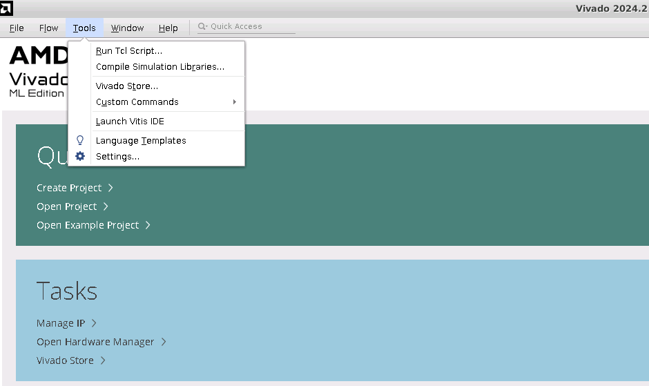
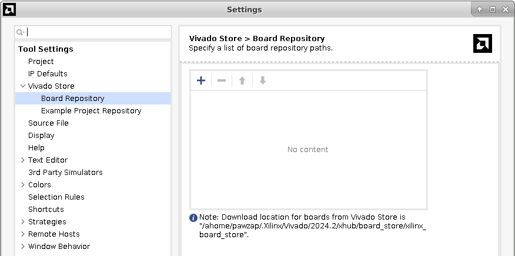
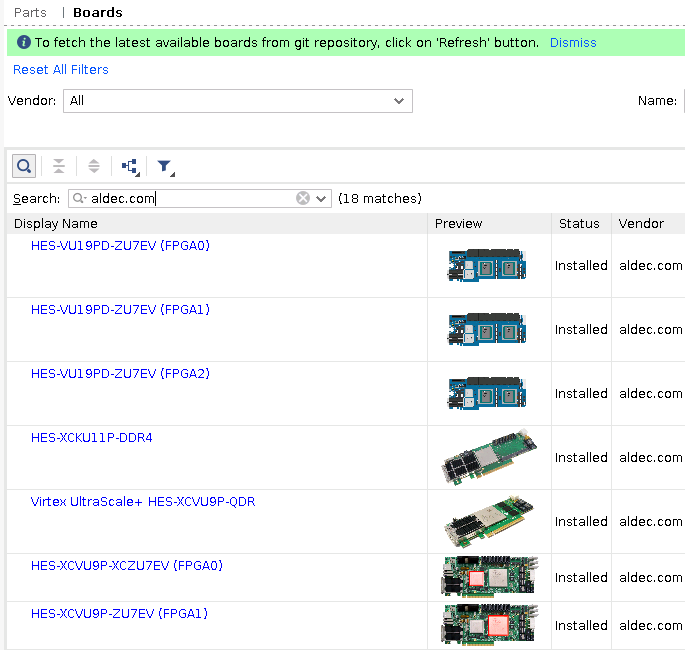

# How to add Aldec HES board defintions to Vivado

1. Open settings in Vivado tool

2. Navigate to Vivado Store -> Board Repository

3. Set path to Vivado board definitions repository
4. Save the configuration
5. Create a new project with using a board definition

